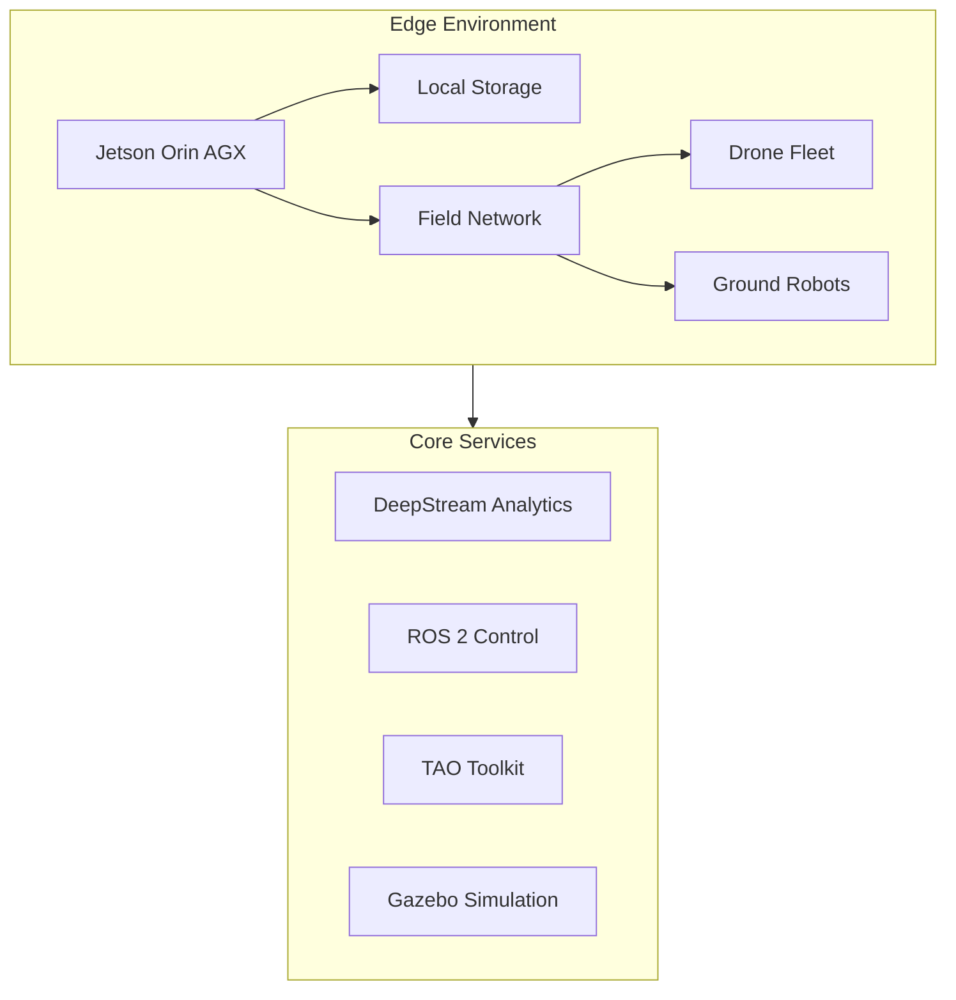

# Containerized Autonomous Agricultural Management System

[](LICENSE)
[](https://www.python.org/downloads/)
[](https://docs.docker.com/get-docker/)
[](https://developer.nvidia.com/cuda-downloads)

A cutting-edge integration of NVIDIA's DeepStream, TAO Toolkit, ROS 2 JAZZY, and Gazebo technologies for autonomous agricultural management, orchestrated through Docker containers on Jetson Orin hardware.

## Executive Summary

The Containerized Autonomous Agricultural Management System enables agricultural operations to deploy coordinated fleets of autonomous drones and ground robots for real-time crop monitoring, pest detection, and targeted intervention. Key features include:

- Real-time video analytics with <100ms latency
- Support for 8+ simultaneous drone feeds
- 95% pest detection accuracy
- Coordinated fleet management
- Containerized deployment for scalability

## System Architecture

### High-Level Overview



## Prerequisites

### Hardware Requirements

- **Processor**: NVIDIA Jetson Orin AGX
- **Memory**: 32GB minimum, 64GB recommended
- **Storage**: 512GB NVMe minimum, 1TB recommended
- **GPU**: Integrated NVIDIA Ampere architecture
- **Network**: 10GbE network interface, Wi-Fi 6 capability

### Software Requirements

- **Operating System**: Linux for Tegra (L4T) 35.3.1
- **CUDA**: 11.8
- **Docker**: 23.0+
- **NVIDIA Container Runtime**: 3.13.0+
- **Kubernetes**: 1.26+
- **Python**: 3.10+
- **Node.js**: 18.x LTS

## Installation Guide

1. Clone the repository:
```bash
git clone https://github.com/your-org/agricultural-management-system.git
cd agricultural-management-system
```

2. Set up environment variables:
```bash
cp .env.example .env
# Edit .env with your configuration
```

3. Deploy the containers:
```bash
./deploy.sh --environment production
```

4. Validate the installation:
```bash
./scripts/validate-deployment.sh
```

## Development Guide

### Setting Up Development Environment

1. Install development dependencies:
```bash
pip install -r requirements-dev.txt
```

2. Set up pre-commit hooks:
```bash
pre-commit install
```

3. Start development environment:
```bash
docker-compose -f docker-compose.dev.yml up
```

### Code Standards

- Follow PEP 8 for Python code
- Use ESLint for JavaScript
- Write unit tests for all new features
- Maintain 80% code coverage minimum

## Security

### Authentication & Authorization

- OAuth 2.0 + OpenID Connect via Keycloak
- Role-Based Access Control (RBAC)
- JWT token-based API authentication
- Multi-factor authentication for administrative access

### Data Protection

- AES-256-GCM encryption for data at rest
- TLS 1.3 for data in transit
- Signed container images
- HashiCorp Vault for secrets management

## Monitoring

### System Health

- Prometheus metrics collection
- Grafana dashboards
- OpenTelemetry tracing
- ELK stack for log aggregation

### Performance Metrics

| Metric | Target | Validation |
|--------|--------|------------|
| Video Processing Latency | <100ms | Continuous monitoring |
| Drone Feed Support | 8+ feeds | Load testing |
| Detection Accuracy | 95% | Weekly automated testing |
| System Uptime | 99.9% | Uptime monitoring |

## Maintenance

### Backup & Recovery

- Automated daily backups
- Point-in-time recovery capability
- Geo-redundant storage
- 30-day retention policy

### Updates & Upgrades

- Rolling updates strategy
- Zero-downtime deployments
- Automated rollback capability
- Version compatibility validation

## Contributing

Please read [CONTRIBUTING.md](CONTRIBUTING.md) for details on our code of conduct and the process for submitting pull requests.

## Security Vulnerabilities

Please review our [Security Policy](SECURITY.md) for reporting vulnerabilities.

## License

This project is licensed under the MIT License - see the [LICENSE](LICENSE) file for details.

## Additional Documentation

- [Backend Services](src/backend/README.md)
- [Web Dashboard](src/web/README.md)
- [Deployment Guide](deployment/README.md)

## Support

For support and questions, please:
1. Check the documentation
2. Search existing issues
3. Create a new issue if needed

## Acknowledgments

- NVIDIA for DeepStream and TAO Toolkit
- ROS 2 community
- Gazebo simulation framework
- Open source community

---
Last Updated: auto-generated
Version: 1.0.0
Maintainers: Development Team