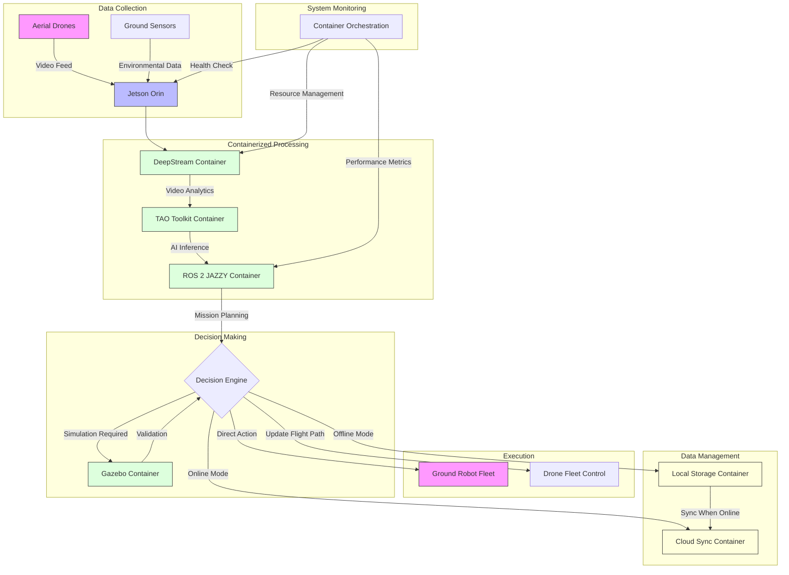
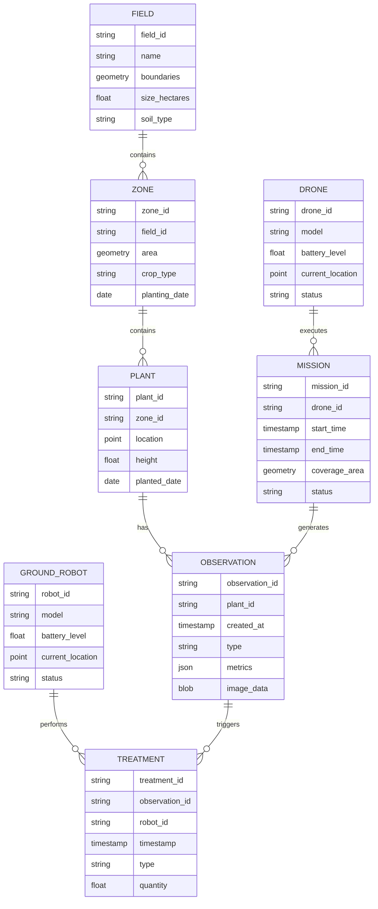
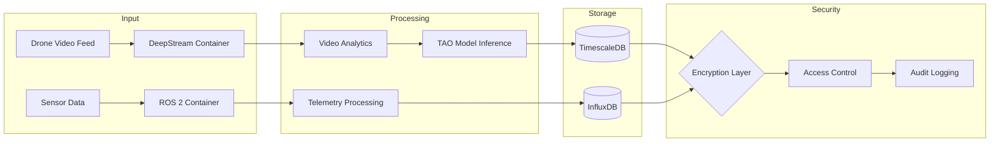

# Product Requirements Document (PRD)

# 1. INTRODUCTION

## 1.1 Purpose

This Software Requirements Specification (SRS) document provides a comprehensive description of the implementation requirements for a containerized autonomous agricultural management system. It serves as the primary reference for technical and non-technical stakeholders including:

- Development teams implementing the containerized components
- System architects designing the integration between DeepStream, TAO Toolkit, ROS 2, and Gazebo
- Quality assurance teams validating the system requirements
- Project managers overseeing the development lifecycle
- Agricultural domain experts providing input on operational requirements

## 1.2 Scope

The autonomous agricultural management system encompasses a fully dockerized solution that combines aerial and ground robotics for precision agriculture. The system includes:

### Core Functionalities
- Real-time video analytics through containerized DeepStream pipelines
- Automated plant identification and health assessment
- Pest detection and targeted intervention
- Ripeness monitoring and harvest optimization
- Coordinated drone-ground robot operations
- Simulation-based testing and validation

### System Benefits
- Reduced manual intervention in agricultural operations
- Precise and targeted treatment application
- Minimized chemical usage through smart pest management
- Scalable deployment from small plots to large farms
- Consistent performance through containerization
- Platform independence through Docker implementation

### Deliverables
- Containerized DeepStream video analytics pipeline
- Dockerized TAO Toolkit models for agricultural analysis
- ROS 2 JAZZY communication framework in containers
- Gazebo simulation environment for testing
- Integration layer for Jetson Orin deployment
- API documentation for system interaction
- Deployment and scaling documentation

### Exclusions
- Hardware design specifications for drones and ground robots
- Agricultural chemical formulations
- Crop-specific farming practices
- Business operation procedures
- End-user training materials

# 2. PRODUCT DESCRIPTION

## 2.1 Product Perspective
The containerized autonomous agricultural management system operates as a distributed system with the Jetson Orin supercomputer as its central hub. The system integrates with:

- Aerial drone platforms for data collection and surveillance
- Ground robots for physical intervention and treatment
- Local storage systems for offline operation
- Cloud services for extended capabilities (when in online mode)
- Existing farm management systems through standardized APIs
- Weather monitoring systems for environmental context
- Soil sensors and irrigation systems

## 2.2 Product Functions

### Core System Functions
- Real-time video analytics processing through containerized DeepStream
- Multi-drone fleet coordination and mission planning
- Automated plant health assessment and diagnostics
- Precision pest detection and targeted treatment
- Harvest timing optimization through ripeness detection
- Autonomous navigation and obstacle avoidance
- Data synchronization between edge and cloud (online mode)

### Management Functions
- Container orchestration and lifecycle management
- System health monitoring and diagnostics
- Automated backup and recovery procedures
- Resource allocation and optimization
- Security policy enforcement
- Version control and update management

## 2.3 User Characteristics

### Primary Users
- **Farm Operators**: Technical knowledge of basic system operation, mobile/web interfaces
- **Agricultural Specialists**: Deep domain knowledge, limited technical expertise
- **System Administrators**: Advanced technical expertise in containerization and deployment

### Secondary Users
- **Data Analysts**: Experience with agricultural data analysis and visualization
- **Maintenance Technicians**: Hardware and basic software troubleshooting skills
- **Integration Developers**: Programming expertise for system customization

## 2.4 Constraints

### Technical Constraints
- Must operate on Jetson Orin hardware platform
- Docker container compatibility with ARM architecture
- Network bandwidth limitations in rural deployments
- Real-time processing requirements for video analytics
- Storage capacity for offline operation
- Battery life limitations for mobile units

### Operational Constraints
- Weather-dependent drone operations
- Daylight-only visual processing capabilities
- Limited operation during extreme weather conditions
- Regulatory compliance with drone flight regulations
- Chemical handling and application restrictions
- Field size and coverage limitations

### Security Constraints
- Data encryption requirements
- Access control for system operations
- Secure container registry requirements
- Network isolation capabilities
- Audit logging requirements
- Compliance with agricultural data privacy regulations

## 2.5 Assumptions and Dependencies

### Assumptions
- Stable power supply for Jetson Orin operation
- Sufficient GPS coverage for navigation
- Basic network infrastructure availability
- Regular system maintenance will be performed
- Users will follow operational guidelines
- Field conditions permit robot navigation

### Dependencies
- NVIDIA DeepStream SDK availability
- TAO Toolkit model compatibility
- ROS 2 JAZZY framework support
- Gazebo simulation environment
- Docker container runtime
- GPU drivers and CUDA support
- Network time synchronization services
- Weather data services
- Mapping and navigation services

# 3. PROCESS FLOWCHART

# 4. FUNCTIONAL REQUIREMENTS

## 4.1 Video Analytics Pipeline

### ID: F-001
### Description
Real-time processing of aerial drone video feeds using containerized DeepStream for plant analysis, pest detection, and crop monitoring.
### Priority: High
### Requirements

| Requirement ID | Description | Acceptance Criteria |
|---------------|-------------|-------------------|
| F-001-1 | Process minimum 4K resolution video at 30 FPS | Video processing maintains frame rate with <100ms latency |
| F-001-2 | Support simultaneous processing of up to 8 drone feeds | System handles multiple streams without performance degradation |
| F-001-3 | Implement object detection for 50+ plant species | >95% accuracy in optimal lighting conditions |
| F-001-4 | Enable real-time pest identification | Detection latency <200ms with >90% accuracy |
| F-001-5 | Provide ripeness classification | Accurate classification across 5 ripeness stages |

## 4.2 Autonomous Navigation

### ID: F-002
### Description
Coordinated navigation system for drone fleet and ground robots using ROS 2 JAZZY framework.
### Priority: High
### Requirements

| Requirement ID | Description | Acceptance Criteria |
|---------------|-------------|-------------------|
| F-002-1 | Autonomous path planning for aerial units | Collision-free routes with optimal coverage patterns |
| F-002-2 | Ground robot navigation in crop rows | Precise movement with <5cm deviation from planned path |
| F-002-3 | Obstacle detection and avoidance | Real-time obstacle avoidance with 100% success rate |
| F-002-4 | Multi-robot coordination | Synchronized operations without conflicts |
| F-002-5 | Return-to-base functionality | Automatic return when battery below 20% |

## 4.3 AI Model Management

### ID: F-003
### Description
TAO Toolkit container for model training, deployment, and optimization.
### Priority: Medium
### Requirements

| Requirement ID | Description | Acceptance Criteria |
|---------------|-------------|-------------------|
| F-003-1 | Support transfer learning for new crop types | Model adaptation within 24 hours of training |
| F-003-2 | Automated model versioning | Version control with rollback capability |
| F-003-3 | Model performance monitoring | Real-time accuracy metrics and alerts |
| F-003-4 | Edge optimization for Jetson Orin | Models optimized for edge deployment |
| F-003-5 | Continuous model improvement | Weekly model updates based on new data |

## 4.4 Simulation Environment

### ID: F-004
### Description
Gazebo-based simulation system for testing and validation.
### Priority: Medium
### Requirements

| Requirement ID | Description | Acceptance Criteria |
|---------------|-------------|-------------------|
| F-004-1 | Virtual field environment creation | Accurate representation of real field conditions |
| F-004-2 | Robot behavior simulation | 95% correlation with real-world performance |
| F-004-3 | Weather condition simulation | Support for various environmental conditions |
| F-004-4 | Sensor simulation | Accurate simulation of all deployed sensors |
| F-004-5 | Mission rehearsal capability | Complete mission simulation before deployment |

## 4.5 Data Management

### ID: F-005
### Description
System for handling data collection, storage, and synchronization in both online and offline modes.
### Priority: High
### Requirements

| Requirement ID | Description | Acceptance Criteria |
|---------------|-------------|-------------------|
| F-005-1 | Local data storage management | Minimum 30 days of data retention |
| F-005-2 | Cloud synchronization | Automatic sync when online with conflict resolution |
| F-005-3 | Data compression and archiving | 50% reduction in storage requirements |
| F-005-4 | Audit trail maintenance | Complete logging of all system operations |
| F-005-5 | Data backup and recovery | Recovery time objective <4 hours |

## 4.6 Container Orchestration

### ID: F-006
### Description
Docker container management and orchestration system.
### Priority: High
### Requirements

| Requirement ID | Description | Acceptance Criteria |
|---------------|-------------|-------------------|
| F-006-1 | Automated container deployment | Container deployment in <5 minutes |
| F-006-2 | Container health monitoring | Real-time health status with auto-recovery |
| F-006-3 | Resource allocation management | Optimal resource utilization across containers |
| F-006-4 | Version control and updates | Zero-downtime updates for all containers |
| F-006-5 | Container security compliance | Regular security scans and updates |

# 5. NON-FUNCTIONAL REQUIREMENTS

## 5.1 Performance Requirements

| Requirement ID | Category | Description | Target Metric |
|---------------|-----------|-------------|---------------|
| P-001 | Processing Speed | DeepStream video analytics latency | <100ms per frame |
| P-002 | Throughput | Simultaneous drone video stream processing | 8 streams at 4K/30FPS |
| P-003 | Resource Usage | GPU utilization on Jetson Orin | <85% under peak load |
| P-004 | Memory Usage | Container memory consumption | <16GB total system RAM |
| P-005 | Storage I/O | Data write speed for local storage | >100MB/s sustained |
| P-006 | Network | Maximum bandwidth per drone connection | <15Mbps per stream |
| P-007 | Container Startup | Time to launch all system containers | <30 seconds |

## 5.2 Safety Requirements

| Requirement ID | Category | Description | Implementation |
|---------------|-----------|-------------|----------------|
| S-001 | Failsafe Operations | Automated return-to-home for low battery | Trigger at 20% battery |
| S-002 | Emergency Shutdown | Container graceful shutdown procedure | Complete within 5 seconds |
| S-003 | Data Backup | Automated backup of critical system data | Every 6 hours |
| S-004 | Collision Avoidance | Minimum distance maintenance between units | 5m horizontal, 10m vertical |
| S-005 | Environmental Protection | Chemical application limits | Within EPA guidelines |
| S-006 | Hardware Protection | Thermal throttling for Jetson Orin | Activate at 85°C |
| S-007 | Redundancy | Critical service container redundancy | N+1 configuration |

## 5.3 Security Requirements

| Requirement ID | Category | Description | Specification |
|---------------|-----------|-------------|---------------|
| SEC-001 | Authentication | Multi-factor authentication for system access | OAuth 2.0 compliance |
| SEC-002 | Authorization | Role-based access control for containers | RBAC implementation |
| SEC-003 | Data Encryption | End-to-end encryption for all communications | AES-256 minimum |
| SEC-004 | Container Security | Regular security scanning of containers | Daily automated scans |
| SEC-005 | Network Security | Isolated container networks | Zero-trust architecture |
| SEC-006 | Audit Logging | Comprehensive system activity logging | Retained for 90 days |
| SEC-007 | Secure Storage | Encrypted storage for sensitive data | FIPS 140-2 compliance |

## 5.4 Quality Requirements

### 5.4.1 Availability
- System uptime: 99.9% during operational hours
- Planned maintenance window: 4 hours monthly
- Maximum unplanned downtime: 8 hours per month
- Container service availability: 99.99%

### 5.4.2 Maintainability
- Container update time: <15 minutes
- Hot-swappable components: All non-critical containers
- Documentation: Updated within 24 hours of changes
- Monitoring coverage: 100% of containers and services

### 5.4.3 Usability
- System interface response time: <500ms
- Training requirement: <8 hours for basic operation
- Error messages: Clear, actionable, and logged
- Interface accessibility: WCAG 2.1 Level AA compliance

### 5.4.4 Scalability
- Horizontal scaling: Up to 24 drones per system
- Vertical scaling: Support for multiple Jetson Orin units
- Storage scaling: Expandable to 20TB per system
- Container orchestration: Support for Kubernetes integration

### 5.4.5 Reliability
- Mean Time Between Failures (MTBF): >720 hours
- Mean Time To Recovery (MTTR): <30 minutes
- Data durability: 99.999999999%
- Backup success rate: 99.99%

## 5.5 Compliance Requirements

| Requirement ID | Category | Description | Standard/Regulation |
|---------------|-----------|-------------|-------------------|
| C-001 | Data Privacy | Agricultural data handling | GDPR, CCPA compliance |
| C-002 | Drone Operations | Flight regulations compliance | FAA Part 107 |
| C-003 | Chemical Usage | Pesticide application tracking | EPA standards |
| C-004 | Software Licensing | Open-source compliance | GPL, MIT license terms |
| C-005 | Safety Standards | Robot operation safety | ISO 10218-1 |
| C-006 | Environmental | Environmental impact assessment | ISO 14001 |
| C-007 | Quality Management | Development and operation processes | ISO 9001:2015 |

# 6. DATA REQUIREMENTS

## 6.1 Data Models

## 6.2 Data Storage

### 6.2.1 Primary Storage
| Data Type | Storage System | Retention Period | Backup Frequency |
|-----------|---------------|------------------|------------------|
| Video Streams | Local NVMe Cache | 24 hours | None |
| Processed Analytics | TimescaleDB | 90 days | Daily |
| Mission Data | PostgreSQL | 1 year | Hourly |
| AI Model Data | Object Storage | Indefinite | Weekly |
| Telemetry Data | InfluxDB | 30 days | Daily |
| System Logs | Elasticsearch | 90 days | Daily |

### 6.2.2 Backup Requirements
- Full system backup every 24 hours
- Incremental backups every 4 hours
- Minimum 3 backup copies across different storage media
- Maximum backup window: 2 hours
- Recovery Time Objective (RTO): 4 hours
- Recovery Point Objective (RPO): 1 hour

### 6.2.3 Storage Scaling
- Initial storage capacity: 2TB
- Scalable to 20TB per system
- Auto-archival of data older than retention period
- Compression ratio target: 5:1
- Hot storage on NVMe for active datasets
- Cold storage on HDD for archived data

## 6.3 Data Processing

### 6.3.1 Data Security Requirements
| Security Measure | Implementation |
|-----------------|----------------|
| Data at Rest | AES-256 encryption |
| Data in Transit | TLS 1.3 |
| Access Control | RBAC with JWT |
| Data Masking | PII and sensitive data |
| Audit Trails | All data access logged |
| Key Management | HashiCorp Vault |

### 6.3.2 Data Processing Requirements
- Real-time video processing at 4K/30FPS
- Maximum latency for analytics: 100ms
- Batch processing window: 4 hours
- Data validation before storage
- Automated data quality checks
- Data deduplication
- Anomaly detection on incoming data

### 6.3.3 Data Integration
- REST APIs for external systems
- gRPC for internal communication
- Message queue for asynchronous processing
- ETL pipelines for data transformation
- Real-time streaming with Apache Kafka
- Data synchronization protocols for offline mode

# 7. EXTERNAL INTERFACES

## 7.1 User Interfaces

### 7.1.1 Web Dashboard Interface
| Component | Description | Requirements |
|-----------|-------------|--------------|
| Mission Control | Real-time monitoring and control panel | Responsive design, <500ms latency |
| Fleet Management | Drone and robot status overview | Live status updates, battery levels |
| Analytics View | Data visualization and reporting | Interactive charts, exportable reports |
| System Settings | Configuration and maintenance interface | Role-based access controls |
| Alert Console | Real-time notification system | Priority-based color coding |

### 7.1.2 Mobile Interface
| Component | Description | Requirements |
|-----------|-------------|--------------|
| Field Operations | Mobile-optimized control interface | Touch-friendly, offline capable |
| Quick Actions | Emergency controls and status | Maximum 2-tap access |
| Data Collection | Manual data entry and photo upload | Local storage with sync |
| Maintenance Tools | Equipment diagnostics and logs | Barcode/QR scanning |

## 7.2 Hardware Interfaces

### 7.2.1 Jetson Orin Interface Requirements
| Interface | Specification | Purpose |
|-----------|--------------|----------|
| GPU | CUDA 11.4+ | DeepStream video processing |
| Memory | 32GB LPDDR5 | Container runtime operations |
| Storage | NVMe PCIe 4.0 | High-speed data storage |
| Network | 10GbE | Drone communication |
| USB | USB 3.2 Gen 2 | Peripheral connectivity |

### 7.2.2 Drone Hardware Interfaces
| Interface | Specification | Purpose |
|-----------|--------------|----------|
| Camera | 4K@30fps MIPI CSI-2 | Video feed input |
| Radio | 900MHz/2.4GHz | Control communication |
| GPS | RTK-enabled | Precision navigation |
| IMU | 9-axis | Flight stabilization |

### 7.2.3 Ground Robot Interfaces
| Interface | Specification | Purpose |
|-----------|--------------|----------|
| Motors | CAN bus | Movement control |
| Sensors | I2C/SPI | Environmental monitoring |
| Actuators | RS-485 | Treatment application |
| LiDAR | USB 3.0 | Obstacle detection |

## 7.3 Software Interfaces

### 7.3.1 Container Interfaces
| Container | Interface Type | Purpose |
|-----------|---------------|----------|
| DeepStream | NVIDIA Container Runtime | GPU acceleration |
| TAO Toolkit | Docker API | Model deployment |
| ROS 2 | DDS | Robot communication |
| Gazebo | ROS 2 Bridge | Simulation integration |

### 7.3.2 Storage Interfaces
| System | Interface | Protocol |
|--------|-----------|----------|
| TimescaleDB | PostgreSQL Wire | Time-series data |
| InfluxDB | HTTP API | Metrics storage |
| Object Storage | S3 Compatible | Model storage |
| Elasticsearch | REST API | Log management |

### 7.3.3 External System Interfaces
| System | Interface Type | Purpose |
|--------|---------------|----------|
| Weather Services | REST API | Environmental data |
| Farm Management | GraphQL | Crop data integration |
| Cloud Services | gRPC | Data synchronization |
| GIS Systems | WMS/WFS | Mapping integration |

## 7.4 Communication Interfaces

### 7.4.1 Network Protocols
| Protocol | Usage | Specification |
|----------|--------|---------------|
| MQTT | Telemetry data | QoS Level 2 |
| WebSocket | Real-time updates | RFC 6455 |
| gRPC | Inter-container | HTTP/2 |
| DDS | ROS 2 communication | OMG DDS 1.4 |

### 7.4.2 Data Formats
| Format | Usage | Schema |
|--------|--------|---------|
| JSON | API responses | OpenAPI 3.0 |
| Protocol Buffers | Container communication | Version 3 |
| CBOR | Sensor data | RFC 8949 |
| Parquet | Analytics storage | Apache Parquet |

### 7.4.3 Security Protocols
| Protocol | Purpose | Implementation |
|----------|----------|----------------|
| TLS 1.3 | Data encryption | X.509 certificates |
| OAuth 2.0 | Authentication | JWT tokens |
| IPSec | Network security | Transport mode |
| DTLS | UDP security | Version 1.3 |

# 8. APPENDICES

## 8.1 GLOSSARY

| Term | Definition |
|------|------------|
| Container Orchestration | The automated management, deployment, scaling, and networking of Docker containers |
| Edge Computing | Processing of data near the source of data generation (Jetson Orin) rather than in a centralized cloud |
| Hot Storage | High-speed storage systems used for frequently accessed data |
| Cold Storage | Lower-cost storage systems used for rarely accessed archival data |
| Transfer Learning | Machine learning technique where pre-trained models are adapted for new but related tasks |
| Zero-trust Architecture | Security model that requires strict identity verification for every person and device |
| Real-time Processing | Data processing performed immediately upon data acquisition |
| Role-based Access Control | Access management approach where permissions are assigned based on roles |

## 8.2 ACRONYMS

| Acronym | Expansion |
|---------|-----------|
| API | Application Programming Interface |
| CUDA | Compute Unified Device Architecture |
| DDS | Data Distribution Service |
| EPA | Environmental Protection Agency |
| FAA | Federal Aviation Administration |
| FIPS | Federal Information Processing Standards |
| GDPR | General Data Protection Regulation |
| GPU | Graphics Processing Unit |
| gRPC | Google Remote Procedure Call |
| IMU | Inertial Measurement Unit |
| JWT | JSON Web Token |
| MQTT | Message Queuing Telemetry Transport |
| NVMe | Non-Volatile Memory Express |
| RBAC | Role-Based Access Control |
| REST | Representational State Transfer |
| ROS | Robot Operating System |
| RTK | Real-Time Kinematic |
| TAO | Train, Adapt, Optimize |
| TLS | Transport Layer Security |
| WCAG | Web Content Accessibility Guidelines |

## 8.3 ADDITIONAL REFERENCES

| Category | Reference | Description |
|----------|-----------|-------------|
| DeepStream | [NVIDIA DeepStream SDK Documentation](https://docs.nvidia.com/metropolis/deepstream/dev-guide/) | Comprehensive guide for DeepStream implementation |
| TAO Toolkit | [TAO Toolkit Documentation](https://docs.nvidia.com/tao/tao-toolkit/) | Reference for model training and optimization |
| ROS 2 | [ROS 2 JAZZY Documentation](https://docs.ros.org/en/jazzy/) | Framework documentation for robotics integration |
| Docker | [Docker for NVIDIA Container Runtime](https://docs.nvidia.com/datacenter/cloud-native/) | Container deployment on NVIDIA platforms |
| Gazebo | [Gazebo ROS 2 Integration](http://gazebosim.org/docs/latest/ros2_overview) | Simulation environment setup and integration |
| Standards | [ISO 10218-1:2011](https://www.iso.org/standard/51330.html) | Safety requirements for industrial robots |
| Compliance | [FAA Part 107](https://www.faa.gov/uas/commercial_operators/part_107) | Drone operation regulations |
| Security | [NIST Cybersecurity Framework](https://www.nist.gov/cyberframework) | Security implementation guidelines |