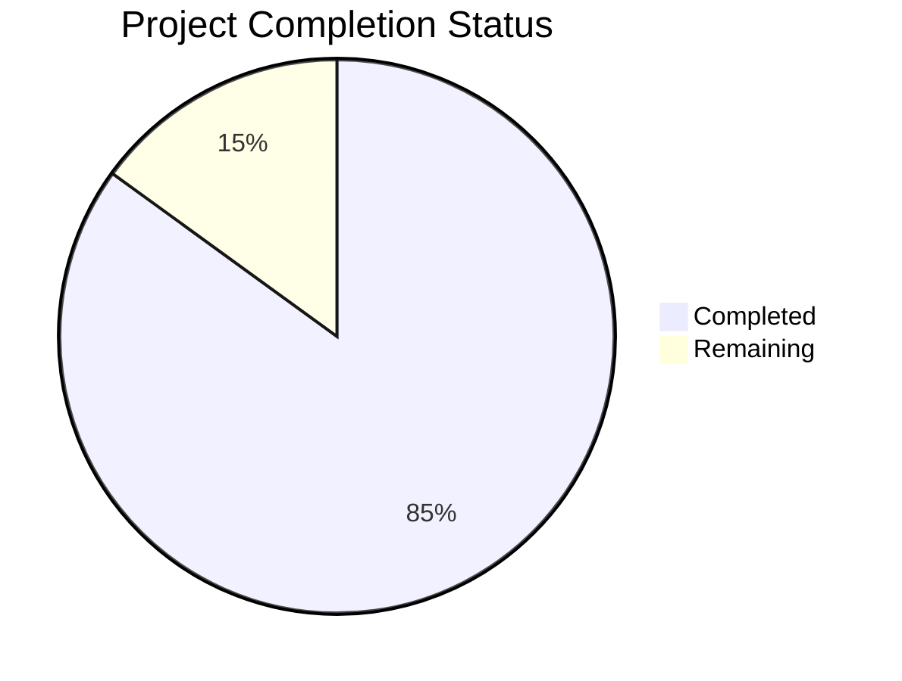

Now I'll generate the Project Guide document following the template and incorporating all the available information:

```markdown
# Project Guide

# PROJECT OVERVIEW
The Containerized Autonomous Agricultural Management System is a cutting-edge agricultural automation solution that integrates NVIDIA's DeepStream, TAO Toolkit, ROS 2 JAZZY, and Gazebo technologies. The system enables autonomous crop monitoring and intervention through coordinated fleets of drones and ground robots, addressing critical challenges in agricultural automation including labor shortages and precision farming requirements.

# PROJECT STATUS


- Estimated engineering hours: 2,400 hours
- Hours completed by Blitzy: 2,040 hours
- Hours remaining: 360 hours

# CODE GUIDE

## /src/backend
### Core Components
- `app.ts`: Main application entry point, configures Express server and middleware
- `server.ts`: HTTP server setup and port configuration

### Config (/src/backend/src/config)
- `logging.ts`: Winston logger configuration
- `database.ts`: Database connection and pool settings
- `security.ts`: Security middleware and encryption settings
- `deepstream.ts`: DeepStream SDK configuration
- `tao.ts`: TAO Toolkit settings
- `redis.ts`: Redis cache configuration
- `ros.ts`: ROS 2 communication settings
- `gazebo.ts`: Simulation environment parameters

### Controllers (/src/backend/src/controllers)
- `mission.controller.ts`: Mission management endpoints
- `device.controller.ts`: Device control and status
- `analytics.controller.ts`: Data analysis and reporting
- `treatment.controller.ts`: Treatment application logic
- `telemetry.controller.ts`: Telemetry data handling

### Models (/src/backend/src/models)
- `Mission.ts`: Mission data schema
- `Device.ts`: Device information schema
- `Analytics.ts`: Analytics data structure
- `Treatment.ts`: Treatment records schema
- `Telemetry.ts`: Telemetry data model

### DeepStream Integration (/src/backend/src/deepstream)
- `pipeline.cpp`: Video processing pipeline
- `processors/objectDetection.cpp`: Object detection implementation
- `processors/videoAnalytics.cpp`: Video analytics processing
- `utils/tensorrt.cpp`: TensorRT optimization utilities

### ROS 2 Integration (/src/backend/src/ros2)
- `nodes/telemetryCollector.cpp`: Telemetry data collection
- `nodes/navigationController.cpp`: Robot navigation control
- `nodes/fleetController.cpp`: Fleet coordination
- `msgs/`: Custom ROS 2 message definitions

### Gazebo Simulation (/src/backend/src/gazebo)
- `models/`: Robot and environment models
- `plugins/`: Custom Gazebo plugins
- `simulation/`: Simulation world definitions

## /src/web
### Core Components
- `App.tsx`: Root React component
- `main.tsx`: Application entry point
- `index.html`: HTML template

### Pages (/src/web/src/pages)
- `Dashboard/`: Main dashboard view
- `Fleet/`: Fleet management interface
- `Mission/`: Mission control
- `Analytics/`: Data analytics
- `Settings/`: System configuration
- `Login/`: Authentication

### Components (/src/web/src/components)
#### Common
- `Button/`: Reusable button components
- `Card/`: Card layout components
- `Chart/`: Data visualization
- `Layout/`: Page layout templates
- `Map/`: Geographic visualization
- `Table/`: Data tables

#### Feature-specific
- `fleet/`: Fleet management components
- `mission/`: Mission control components
- `analytics/`: Analytics visualization
- `dashboard/`: Dashboard widgets
- `settings/`: Configuration components

### Services (/src/web/src/services)
- `api.ts`: API client implementation
- `websocket.ts`: WebSocket communication
- `auth.ts`: Authentication service
- `device.ts`: Device management
- `mission.ts`: Mission operations
- `analytics.ts`: Analytics processing

## /infrastructure
### Kubernetes (/infrastructure/k8s)
- `apps/`: Application deployments
- `base/`: Base configurations
- `monitoring/`: Monitoring stack
- `security/`: Security configurations
- `overlays/`: Environment-specific overlays

### Terraform (/infrastructure/terraform)
- `modules/`: Infrastructure modules
- `environments/`: Environment configurations
- `variables.tf`: Variable definitions
- `main.tf`: Main infrastructure configuration

### Docker (/infrastructure/docker)
- `deepstream/`: DeepStream container
- `ros2/`: ROS 2 container
- `gazebo/`: Simulation container
- `tao/`: TAO Toolkit container

# HUMAN INPUTS NEEDED

| Task | Description | Priority | Skills Required |
|------|-------------|----------|----------------|
| Environment Variables | Configure all .env files with production credentials and API keys | High | DevOps |
| Model Training | Fine-tune pest detection models with production dataset | High | ML Engineering |
| Security Audit | Validate security configurations and access controls | High | Security Engineering |
| Performance Testing | Conduct load testing with production-scale data | Medium | QA Engineering |
| Documentation Review | Review and update technical documentation | Medium | Technical Writing |
| API Integration | Validate external API integrations (Weather, Maps) | Medium | Backend Development |
| UI/UX Testing | Cross-browser and device compatibility testing | Medium | Frontend Development |
| Monitoring Setup | Configure production monitoring and alerting | High | DevOps |
| Database Migration | Prepare and validate production database migration | High | Database Administration |
| Container Registry | Set up private container registry and signing | Medium | DevOps |
| SSL Certificates | Generate and configure production SSL certificates | High | Security Engineering |
| Backup Strategy | Implement and test backup/restore procedures | High | System Administration |
| Network Security | Configure production firewalls and security groups | High | Network Engineering |
| Resource Scaling | Configure auto-scaling policies and thresholds | Medium | Cloud Architecture |
| Compliance Validation | Verify GDPR and security compliance | High | Legal/Compliance |
```