# Technical Specifications

# 1. INTRODUCTION

## 1.1 EXECUTIVE SUMMARY

The Containerized Autonomous Agricultural Management System represents a cutting-edge integration of NVIDIA's DeepStream, TAO Toolkit, ROS 2 JAZZY, and Gazebo technologies, orchestrated through Docker containers on Jetson Orin hardware. This system addresses the critical agricultural industry challenges of labor shortages, precision farming requirements, and sustainable resource management through automated crop monitoring and intervention.

The solution enables agricultural operations to deploy coordinated fleets of autonomous drones and ground robots for real-time crop monitoring, pest detection, and targeted intervention. By leveraging containerized AI/ML capabilities and robust robotics frameworks, the system delivers consistent, scalable, and maintainable autonomous operations across diverse agricultural environments.

## 1.2 SYSTEM OVERVIEW

### Project Context

| Aspect | Description |
|--------|-------------|
| Business Context | Agricultural automation market experiencing 19.3% CAGR with critical need for scalable, autonomous solutions |
| Current Limitations | Existing systems lack containerization, making deployment and maintenance complex |
| Enterprise Integration | Interfaces with existing farm management systems, weather services, and agricultural databases |

### High-Level Description

| Component | Capabilities |
|-----------|-------------|
| DeepStream Pipeline | Real-time video analytics for crop monitoring and pest detection |
| TAO Toolkit Integration | Transfer learning for agricultural model optimization |
| ROS 2 Framework | Coordinated control of drone and ground robot fleets |
| Gazebo Simulation | Virtual testing and validation environment |
| Docker Infrastructure | Containerized deployment and orchestration |

### Success Criteria

| Category | Metrics |
|----------|---------|
| Performance | - Video processing latency <100ms<br>- Support for 8+ simultaneous drone feeds<br>- 95% pest detection accuracy |
| Scalability | - Linear scaling to 24+ drones<br>- Support for 1000+ hectare operations |
| Reliability | - 99.9% system uptime<br>- <30 minute recovery time |
| Efficiency | - 30% reduction in chemical usage<br>- 50% reduction in manual intervention |

## 1.3 SCOPE

### In-Scope Elements

| Category | Components |
|----------|------------|
| Core Features | - Real-time aerial surveillance<br>- Automated pest detection<br>- Precision treatment application<br>- Fleet coordination<br>- Offline/Online operation modes |
| Implementation | - Containerized AI pipelines<br>- Robotic control systems<br>- Simulation environment<br>- Data management infrastructure |
| User Groups | - Farm operators<br>- Agricultural specialists<br>- System administrators |
| Technical Coverage | - Edge processing<br>- Container orchestration<br>- Computer vision<br>- Robotics control |

### Out-of-Scope Elements

| Category | Exclusions |
|----------|------------|
| Features | - Manual control interfaces<br>- Crop yield prediction<br>- Soil composition analysis<br>- Weather forecasting |
| Hardware | - Drone/robot hardware design<br>- Physical sensor specifications<br>- Network infrastructure setup |
| Operations | - Chemical formulation<br>- Crop-specific farming practices<br>- Business process optimization |
| Support | - End-user training programs<br>- Hardware maintenance procedures<br>- Agricultural consulting services |

# 2. SYSTEM ARCHITECTURE

## 2.1 High-Level Architecture

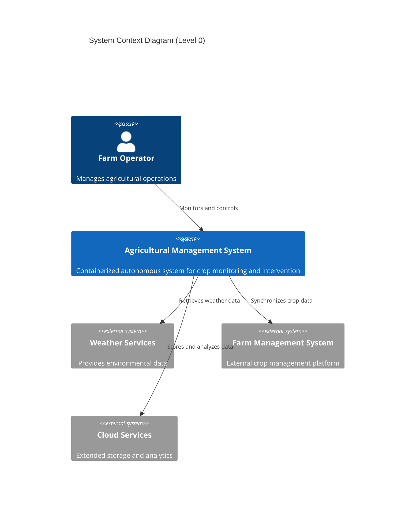

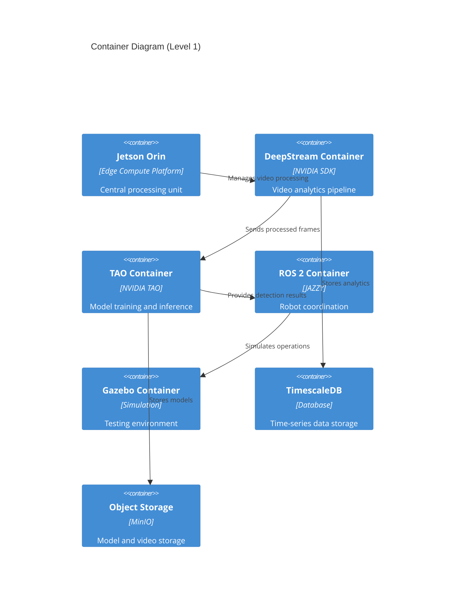

## 2.2 Component Details

### 2.2.1 Core Components

| Component | Purpose | Technology Stack | Scaling Strategy |
|-----------|---------|-----------------|------------------|
| DeepStream Pipeline | Video processing | NVIDIA DeepStream SDK, CUDA | Horizontal via multiple instances |
| TAO Toolkit | Model management | NVIDIA TAO, TensorRT | Vertical with GPU scaling |
| ROS 2 Framework | Robot control | ROS 2 JAZZY, DDS | Horizontal per robot fleet |
| Gazebo Simulation | Testing environment | Gazebo, ROS 2 Bridge | Vertical with CPU scaling |
| Data Storage | Persistence layer | TimescaleDB, MinIO | Horizontal sharding |

### 2.2.2 Communication Patterns

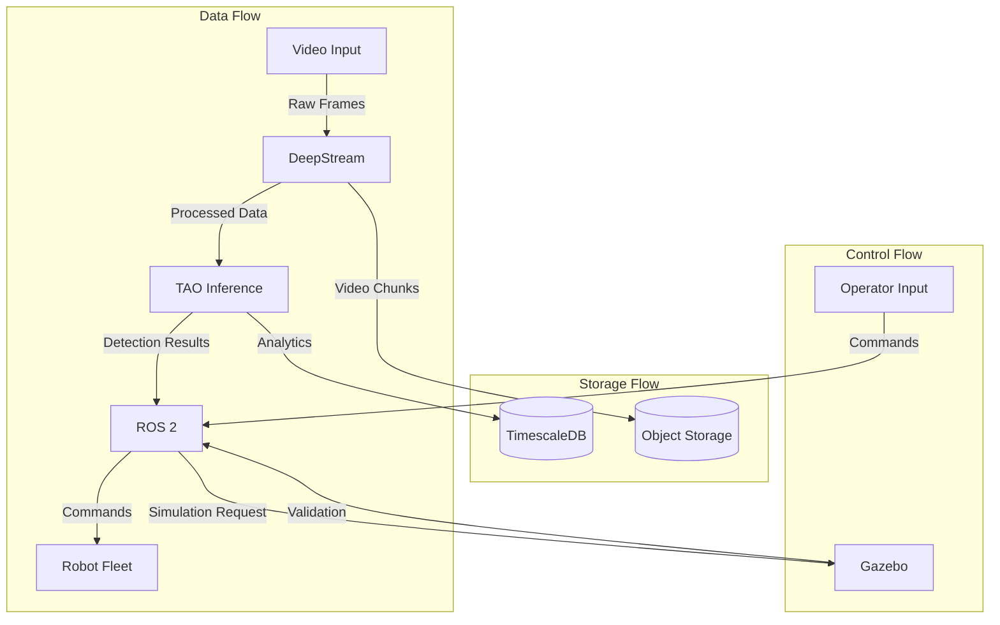

## 2.3 Technical Decisions

### 2.3.1 Architecture Patterns

| Pattern | Implementation | Justification |
|---------|---------------|---------------|
| Microservices | Docker containers | Isolation, scalability, maintainability |
| Event-driven | ROS 2 DDS | Real-time robot coordination |
| Edge Computing | Jetson Orin | Low-latency processing, offline operation |
| Layered Storage | Hot/Cold architecture | Performance optimization, cost efficiency |

### 2.3.2 Data Architecture

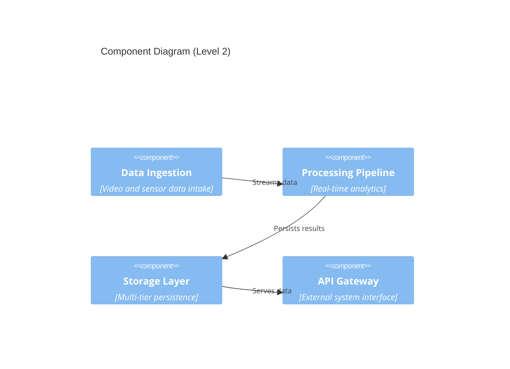

## 2.4 Cross-Cutting Concerns

### 2.4.1 System Monitoring

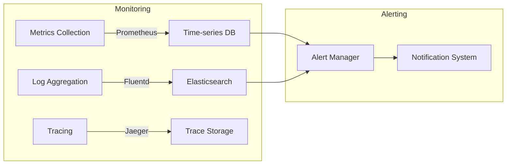

### 2.4.2 Security Architecture

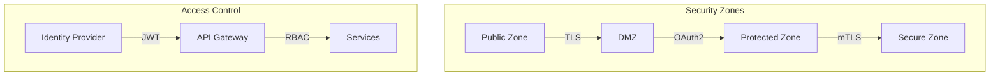

## 2.5 Deployment Architecture

```mermaid
C4Deployment
    title Deployment Diagram
    
    Deployment_Node(field, "Field Environment", "Agricultural Setting"){
        Deployment_Node(edge, "Edge Cluster", "Jetson Orin"){
            Container(core, "Core Services", "Container Stack")
            Container(db, "Local Storage", "Databases")
        }
        
        Deployment_Node(robots, "Robot Fleet"){
            Container(drones, "Aerial Units", "Drones")
            Container(ground, "Ground Units", "Robots")
        }
    }
    
    Deployment_Node(cloud, "Cloud Services", "Optional Extension"){
        Container(sync, "Data Sync", "Cloud Storage")
        Container(analytics, "Advanced Analytics", "ML Pipeline")
    }
    
    Rel(core, robots, "Controls")
    Rel(core, cloud, "Syncs")
```

# 3. SYSTEM COMPONENTS ARCHITECTURE

## 3.1 USER INTERFACE DESIGN

### 3.1.1 Web Dashboard Design Specifications

| Component | Specification | Implementation Details |
|-----------|--------------|----------------------|
| Layout System | CSS Grid/Flexbox | Responsive 12-column grid |
| Color Scheme | Material Design 3.0 | Support for light/dark modes |
| Typography | Roboto/Noto Sans | Variable font loading |
| Accessibility | WCAG 2.1 Level AA | ARIA labels, keyboard navigation |
| Responsiveness | Mobile-first | Breakpoints: 320px, 768px, 1024px, 1440px |
| Internationalization | RTL Support | Dynamic text direction |
| Browser Support | Modern Evergreen | Chrome 90+, Firefox 88+, Safari 14+ |

### 3.1.2 Interface Components

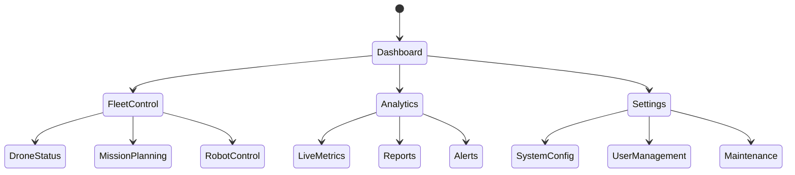

### 3.1.3 CLI Interface Design

| Command Category | Structure | Validation Rules |
|-----------------|-----------|------------------|
| System Control | `system [start\|stop\|status]` | Requires admin privileges |
| Fleet Management | `fleet [deploy\|recall\|status]` | Valid fleet ID required |
| Data Operations | `data [export\|import\|sync]` | File format validation |
| Configuration | `config [get\|set\|list]` | Schema validation |
| Diagnostics | `diag [test\|report\|logs]` | System state verification |

## 3.2 DATABASE DESIGN

### 3.2.1 Schema Design

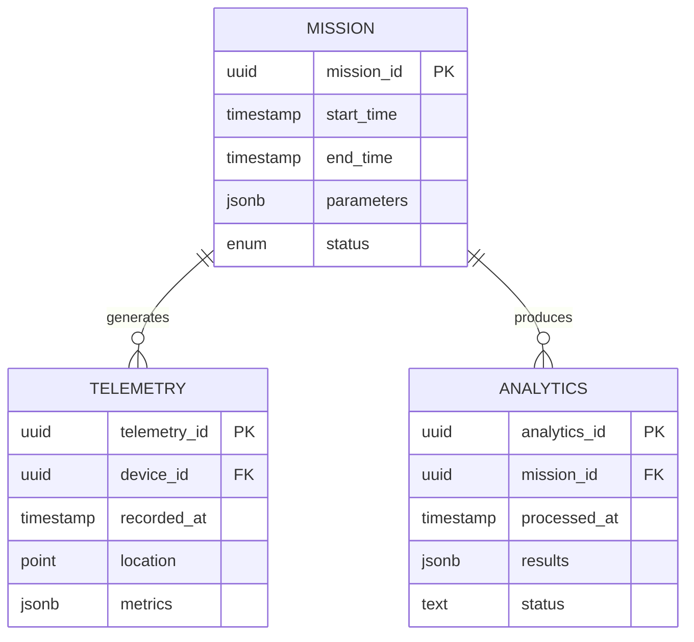

### 3.2.2 Data Management Strategy

| Aspect | Strategy | Implementation |
|--------|----------|----------------|
| Time Series | TimescaleDB | Automated partitioning by time |
| Blob Storage | MinIO | S3-compatible object storage |
| Caching | Redis | 15-minute TTL for hot data |
| Replication | Streaming | Async with 2 replicas |
| Backup | Incremental | 6-hour intervals |
| Retention | Policy-based | 90 days active, 1 year archive |

## 3.3 API DESIGN

### 3.3.1 API Architecture

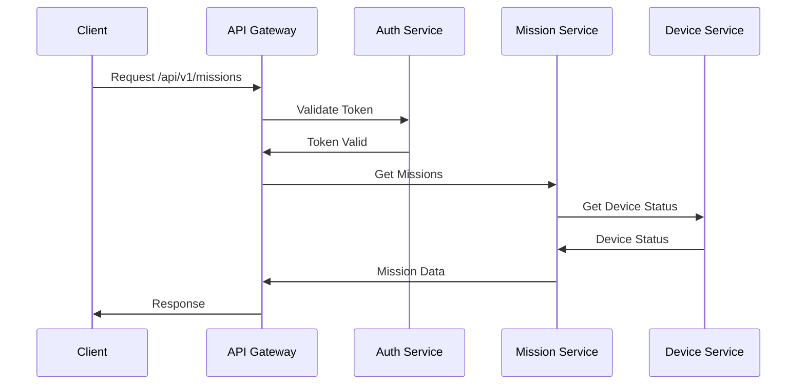

### 3.3.2 API Specifications

| Endpoint | Method | Request Format | Response Format |
|----------|--------|----------------|-----------------|
| /api/v1/missions | POST | JSON payload | Mission object |
| /api/v1/telemetry | STREAM | Binary frames | SSE stream |
| /api/v1/analytics | GET | Query params | JSON array |
| /api/v1/devices | GET | Query params | Device list |
| /api/v1/config | PATCH | JSON patch | Updated config |

### 3.3.3 Integration Patterns

| Pattern | Implementation | Purpose |
|---------|----------------|---------|
| Circuit Breaker | Hystrix | Fault tolerance |
| Rate Limiting | Token bucket | 1000 req/min |
| Authentication | JWT + OAuth2 | Access control |
| Validation | JSON Schema | Request validation |
| Monitoring | OpenTelemetry | Tracing and metrics |
| Documentation | OpenAPI 3.0 | API documentation |

# 4. TECHNOLOGY STACK

## 4.1 PROGRAMMING LANGUAGES

| Platform/Component | Language | Version | Justification |
|-------------------|----------|---------|---------------|
| DeepStream Pipeline | C++ | 17 | NVIDIA SDK optimization, real-time performance |
| ROS 2 Core | C++ | 17 | Low-latency robotics control, hardware integration |
| AI/ML Processing | Python | 3.10 | TAO Toolkit compatibility, ML library ecosystem |
| System Management | Python | 3.10 | Container orchestration, automation scripts |
| Simulation | C++ | 17 | Gazebo native support, physics engine performance |
| API Services | Python | 3.10 | FastAPI async support, type safety |

## 4.2 FRAMEWORKS & LIBRARIES

### Core Frameworks

| Framework | Version | Purpose | Dependencies |
|-----------|---------|---------|--------------|
| DeepStream SDK | 6.2 | Video analytics | CUDA 11.4+, TensorRT 8.5 |
| TAO Toolkit | 4.0 | Model training | PyTorch 1.13, TensorFlow 2.9 |
| ROS 2 JAZZY | Iron | Robot control | DDS FastRTPS 2.10 |
| Gazebo | 11.0 | Simulation | OGRE 1.12, Bullet Physics 3.24 |
| FastAPI | 0.95 | API services | Pydantic 1.10, uvicorn 0.21 |

### Supporting Libraries

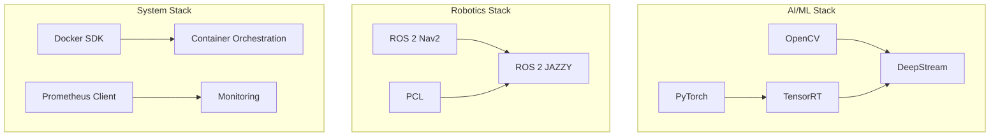

## 4.3 DATABASES & STORAGE

### Primary Databases

| Database | Version | Purpose | Scaling Strategy |
|----------|---------|---------|-----------------|
| TimescaleDB | 2.11 | Time-series data | Horizontal partitioning |
| PostgreSQL | 15.3 | Relational data | Master-slave replication |
| MinIO | RELEASE.2023-07-07 | Object storage | Distributed deployment |
| Redis | 7.0 | Caching, pub/sub | Cluster mode |

### Storage Architecture

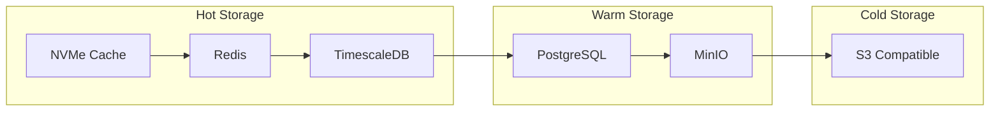

## 4.4 THIRD-PARTY SERVICES

| Service Category | Provider | Purpose | Integration Method |
|-----------------|----------|---------|-------------------|
| Weather Data | OpenWeatherMap | Environmental monitoring | REST API |
| Mapping | MapBox | Geospatial services | SDK |
| Authentication | Keycloak | Identity management | OAuth2/OIDC |
| Monitoring | Prometheus/Grafana | System metrics | Exporters |
| Logging | Elastic Stack | Log aggregation | Filebeat |

## 4.5 DEVELOPMENT & DEPLOYMENT

### Development Tools

| Tool | Version | Purpose |
|------|---------|---------|
| VSCode | Latest | Primary IDE |
| CLion | 2023.2 | C++ development |
| PyCharm | 2023.2 | Python development |
| Docker Desktop | Latest | Local container development |
| NVIDIA Container Toolkit | 1.13 | GPU container support |

### Deployment Pipeline

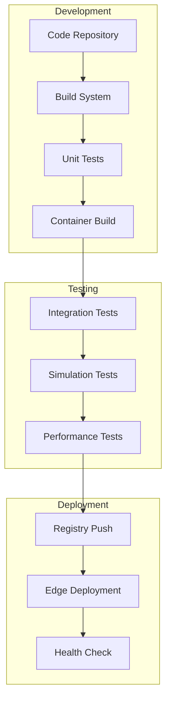

### Build System Requirements

| Component | Tool | Configuration |
|-----------|------|---------------|
| C++ Build | CMake | 3.25+ |
| Python Build | Poetry | 1.4+ |
| Container Build | BuildKit | 0.11+ |
| CI/CD | Jenkins | LTS 2.401+ |
| Artifact Registry | Harbor | 2.8+ |

### Container Requirements

| Requirement | Specification | Justification |
|------------|---------------|---------------|
| Base Image | NVIDIA L4T | Jetson compatibility |
| Runtime | NVIDIA Container Runtime | GPU access |
| Resource Limits | CPU/Memory quotas | Resource isolation |
| Security | Non-root user | CVE mitigation |
| Networking | Host networking | Hardware access |

# 5. SYSTEM DESIGN

## 5.1 USER INTERFACE DESIGN

### 5.1.1 Web Dashboard Layout

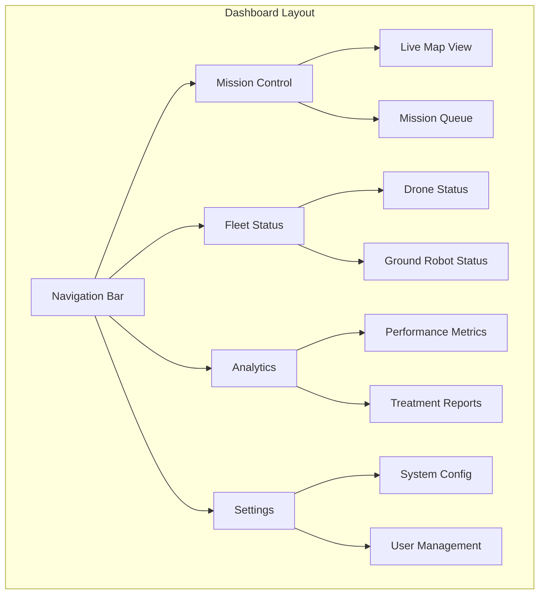

### 5.1.2 Command Line Interface

| Command Category | Command Structure | Description |
|-----------------|-------------------|-------------|
| System Control | `aams system [start\|stop\|status]` | Core system management |
| Fleet Management | `aams fleet [deploy\|recall] --zone=<id>` | Robot fleet operations |
| Mission Control | `aams mission [create\|abort] --type=<scan\|treat>` | Mission management |
| Data Management | `aams data [export\|import] --from=<date> --to=<date>` | Data operations |
| Configuration | `aams config [get\|set] --param=<key> --value=<val>` | System configuration |

## 5.2 DATABASE DESIGN

### 5.2.1 Schema Design

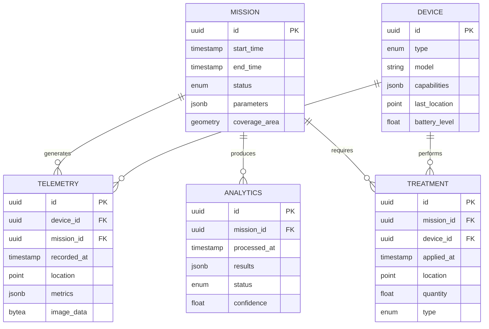

### 5.2.2 Storage Strategy

| Data Type | Storage Solution | Partitioning Strategy | Retention Policy |
|-----------|-----------------|----------------------|------------------|
| Time-series Data | TimescaleDB | By time (1 day chunks) | 90 days |
| Blob Storage | MinIO | By date/mission ID | 1 year |
| Device Telemetry | InfluxDB | By device type | 30 days |
| Mission Analytics | PostgreSQL | By status/date | 1 year |
| System Metrics | Prometheus | By metric type | 15 days |

## 5.3 API DESIGN

### 5.3.1 API Architecture

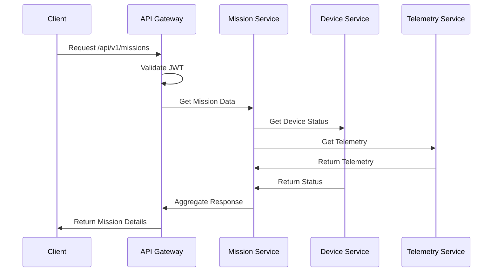

### 5.3.2 API Endpoints

| Endpoint | Method | Request Format | Response Format | Rate Limit |
|----------|--------|----------------|-----------------|------------|
| /api/v1/missions | POST | JSON | Mission Object | 100/min |
| /api/v1/devices | GET | Query Params | Device List | 1000/min |
| /api/v1/telemetry | STREAM | SSE | Event Stream | Unlimited |
| /api/v1/analytics | GET | Query Params | Analytics Object | 500/min |
| /api/v1/treatments | POST | JSON | Treatment Object | 200/min |

### 5.3.3 Message Formats

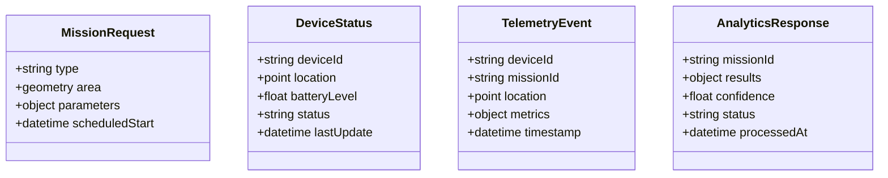

### 5.3.4 Integration Patterns

| Pattern | Implementation | Purpose |
|---------|---------------|----------|
| Circuit Breaker | Hystrix | Fault tolerance |
| Rate Limiting | Token Bucket | API protection |
| Authentication | JWT + OAuth2 | Access control |
| Caching | Redis | Performance |
| Logging | OpenTelemetry | Observability |
| Documentation | OpenAPI 3.0 | API documentation |

# 6. USER INTERFACE DESIGN

## 6.1 Overview

The system provides two primary interfaces: a web-based dashboard for operators and administrators, and a CLI for system management. Both interfaces are containerized and accessible through the Jetson Orin's network interface.

## 6.2 Web Dashboard Layout

### 6.2.1 Main Dashboard
```
+----------------------------------------------------------+
|  [#] Agricultural Management System           [@] [?] [=]  |
+------------------+-----------------------------------+-----+
|                  |                                   |     |
| [*] Dashboard    |   Field Overview                  |     |
| [>] Fleet Status |   +-------------------------+     |     |
| [>] Analytics    |   |     Active Missions     |     |     |
| [>] Missions     |   | [====] Progress: 45%    |     |     |
| [>] Settings     |   +-------------------------+     |     |
|                  |                                   |     |
|                  |   Fleet Status                    |     |
|                  |   +-------------------------+     |     |
|                  |   | Drones Active: 4/6      |     |     |
|                  |   | Ground Units: 3/4       |     |     |
|                  |   | Battery Status [====]   |     |     |
|                  |   +-------------------------+     |     |
|                  |                                   |     |
|                  |   Alerts                         |     |
|                  |   +-------------------------+     |     |
|                  |   | [!] Low battery D-003   |     |     |
|                  |   | [!] Pest detection Z-12 |     |     |
|                  |   +-------------------------+     |     |
+------------------+-----------------------------------+-----+
```

### 6.2.2 Mission Control Interface
```
+----------------------------------------------------------+
|  [#] Mission Control                         [@] [?] [=]   |
+----------------------------------------------------------+
| [+] New Mission   [v] Filter   [...] Search               |
+----------------------------------------------------------+
| Active Missions                                            |
| +------------------------------------------------------+ |
| | ID     | Type    | Status  | Progress | Actions       | |
| |--------|---------|---------|----------|---------------| |
| | M-001  | Survey  | Running | [====]   | [Pause] [x]  | |
| | M-002  | Spray   | Queued  | [...]    | [Start] [x]  | |
| | M-003  | Monitor | Paused  | [===]    | [Resume] [x] | |
| +------------------------------------------------------+ |
|                                                          |
| Mission Details                                          |
| +------------------------------------------------------+ |
| | Coverage Area: 12.5 ha                                | |
| | Assigned Units: D-001, D-002, G-001                  | |
| | Start Time: 2024-02-20 08:00                         | |
| | Est. Completion: 2024-02-20 10:30                    | |
| +------------------------------------------------------+ |
+----------------------------------------------------------+
```

### 6.2.3 Analytics Dashboard
```
+----------------------------------------------------------+
|  [#] Analytics                               [@] [?] [=]   |
+----------------------------------------------------------+
| Time Range: [v] Last 24 Hours    [Export] [Refresh]        |
+----------------------------------------------------------+
| Detection Statistics                                       |
| +----------------------+    +-------------------------+    |
| |   Pest Detection    |    |    Treatment Coverage   |    |
| |                     |    |                         |    |
| |      [Graph]        |    |        [Graph]         |    |
| |                     |    |                         |    |
| +----------------------+    +-------------------------+    |
|                                                          |
| System Performance                                        |
| +----------------------+    +-------------------------+    |
| |   CPU Usage         |    |     GPU Utilization     |    |
| |   [====] 75%        |    |     [=====] 82%         |    |
| +----------------------+    +-------------------------+    |
|                                                          |
| Recent Alerts                                            |
| +------------------------------------------------------+ |
| | [!] High pest activity detected in Zone A-15          | |
| | [i] Treatment completed in Zone B-22                  | |
| | [!] Drone D-003 battery below 25%                    | |
| +------------------------------------------------------+ |
+----------------------------------------------------------+
```

## 6.3 UI Component Key

### Navigation Elements
- [#] Main menu/dashboard icon
- [@] User profile access
- [?] Help/documentation
- [=] Settings menu
- [>] Expandable menu item
- [*] Active/selected item

### Status Indicators
- [!] Warning/alert
- [i] Information
- [====] Progress bar
- [...] Text input field
- [v] Dropdown menu

### Action Elements
- [+] Add/create new
- [x] Close/delete
- [Button] Action button
- [ ] Checkbox
- ( ) Radio button

## 6.4 Interaction Patterns

| Pattern | Implementation | Purpose |
|---------|---------------|----------|
| Drag-and-Drop | Mission planning | Define coverage areas |
| Click-and-Hold | Device selection | Multi-unit commands |
| Double-Click | Item details | Quick access to details |
| Right-Click | Context menu | Additional options |
| Hover | Tooltips | Additional information |

## 6.5 Responsive Design Breakpoints

| Breakpoint | Screen Width | Layout Adjustments |
|------------|-------------|-------------------|
| Mobile | <768px | Single column, collapsed menu |
| Tablet | 768-1024px | Two columns, expandable menu |
| Desktop | >1024px | Full three-column layout |
| Large Display | >1440px | Extended information panels |

## 6.6 Accessibility Requirements

| Feature | Implementation | Standard |
|---------|---------------|----------|
| Keyboard Navigation | Tab order, shortcuts | WCAG 2.1 |
| Screen Reader | ARIA labels | Section 508 |
| Color Contrast | 4.5:1 minimum | WCAG AAA |
| Font Scaling | 200% support | WCAG AA |
| Focus Indicators | Visible outlines | WCAG 2.1 |

# 7. SECURITY CONSIDERATIONS

## 7.1 AUTHENTICATION AND AUTHORIZATION

### 7.1.1 Authentication Methods

| Method | Implementation | Use Case |
|--------|----------------|----------|
| OAuth 2.0 + OpenID Connect | Keycloak Container | Primary user authentication |
| X.509 Certificates | HashiCorp Vault | Container-to-container authentication |
| JWT Tokens | Custom middleware | API authentication |
| API Keys | Redis cache | External service integration |
| Multi-factor Authentication | TOTP (RFC 6238) | Administrative access |

### 7.1.2 Authorization Model

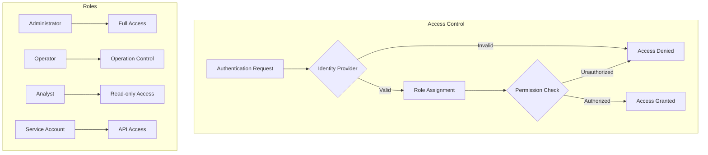

## 7.2 DATA SECURITY

### 7.2.1 Data Protection Measures

| Layer | Protection Method | Implementation |
|-------|------------------|----------------|
| Data at Rest | AES-256-GCM | LUKS container encryption |
| Data in Transit | TLS 1.3 | Mutual TLS between containers |
| Container Images | Signed images | Docker Content Trust |
| Secrets | Encrypted vault | HashiCorp Vault |
| Backups | Encrypted archives | GPG with hardware keys |
| Telemetry Data | Field-level encryption | Application-layer encryption |

### 7.2.2 Data Classification

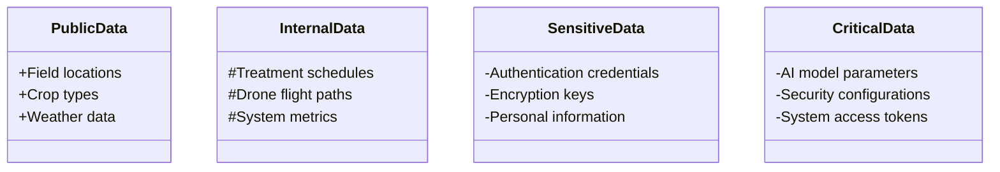

## 7.3 SECURITY PROTOCOLS

### 7.3.1 Network Security

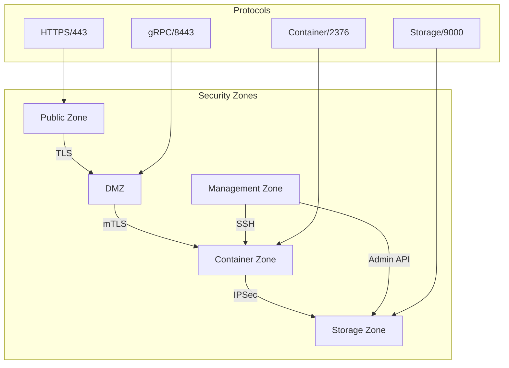

### 7.3.2 Security Controls

| Control Type | Implementation | Purpose |
|-------------|----------------|----------|
| Container Isolation | gVisor runtime | Container sandboxing |
| Network Segmentation | Calico CNI | Micro-segmentation |
| Intrusion Detection | Falco | Runtime security monitoring |
| Vulnerability Scanning | Trivy | Container image scanning |
| Access Logging | OpenTelemetry | Security audit trails |
| Firewall Rules | iptables | Network access control |

### 7.3.3 Security Compliance

| Requirement | Implementation | Verification |
|-------------|----------------|--------------|
| GDPR Compliance | Data encryption, access controls | Annual audit |
| NIST 800-53 | Security controls framework | Quarterly assessment |
| ISO 27001 | Information security management | External certification |
| CIS Benchmarks | Container security baseline | Automated checking |
| OWASP Top 10 | Application security controls | Penetration testing |
| SOC 2 | Security operations controls | Continuous monitoring |

### 7.3.4 Incident Response

```mermaid
stateDiagram-v2
    [*] --> Detection
    Detection --> Analysis
    Analysis --> Containment
    Containment --> Eradication
    Eradication --> Recovery
    Recovery --> PostIncident
    PostIncident --> [*]

    state Detection {
        [*] --> AlertGeneration
        AlertGeneration --> IncidentValidation
    }

    state Containment {
        [*] --> IsolateSystem
        IsolateSystem --> SecureEvidence
    }

    state Recovery {
        [*] --> RestoreServices
        RestoreServices --> VerifyOperation
    }
```

### 7.3.5 Security Monitoring

| Component | Monitoring Method | Alert Threshold |
|-----------|------------------|-----------------|
| Container Security | Falco rules | Any critical violation |
| Network Traffic | Suricata IDS | Suspicious patterns |
| Authentication | Failed attempts | >3 failures/minute |
| API Access | Rate limiting | >100 requests/second |
| Resource Usage | Prometheus metrics | >90% utilization |
| File Integrity | AIDE checks | Any unauthorized change |

# 8. INFRASTRUCTURE

## 8.1 DEPLOYMENT ENVIRONMENT

| Environment Type | Primary Components | Purpose |
|-----------------|-------------------|----------|
| Edge Deployment | Jetson Orin AGX | Core processing and real-time analytics |
| Field Network | Private 5G/Wi-Fi 6 | Drone and robot communication |
| Local Storage | NVMe Arrays | High-speed data storage |
| Optional Cloud | Hybrid Connection | Extended storage and analytics |

```mermaid
flowchart TD
    subgraph Edge["Edge Environment"]
        A[Jetson Orin AGX] --> B[Local Storage]
        A --> C[Field Network]
        C --> D[Drone Fleet]
        C --> E[Ground Robots]
    end
    
    subgraph Optional["Optional Cloud Extension"]
        F[Cloud Gateway] --> G[Cloud Storage]
        F --> H[Advanced Analytics]
    end
    
    Edge --> |Secure VPN| Optional
```

## 8.2 CLOUD SERVICES

| Service | Provider | Purpose | Integration Method |
|---------|----------|---------|-------------------|
| Object Storage | MinIO | Model and data archival | S3 API |
| Time Series DB | TimescaleDB Cloud | Historical analytics | PostgreSQL wire protocol |
| Container Registry | Harbor | Private container registry | Docker Registry API v2 |
| Identity Management | Keycloak | Authentication/authorization | OAuth2/OIDC |
| Monitoring | Grafana Cloud | System telemetry | Prometheus remote write |

## 8.3 CONTAINERIZATION

### Container Architecture

```mermaid
graph TB
    subgraph Base Images
        A[L4T Base] --> B[CUDA Runtime]
        B --> C[DeepStream Base]
        B --> D[ROS 2 Base]
    end
    
    subgraph Application Containers
        C --> E[DeepStream Analytics]
        D --> F[ROS 2 Control]
        B --> G[TAO Toolkit]
        B --> H[Gazebo Simulation]
    end
    
    subgraph Support Containers
        I[TimescaleDB]
        J[Redis Cache]
        K[MinIO Storage]
        L[Prometheus]
    end
```

### Container Specifications

| Container | Base Image | Resource Limits | Persistence |
|-----------|------------|-----------------|-------------|
| DeepStream | nvcr.io/nvidia/deepstream:6.2 | 8GB RAM, 2 GPU cores | Volume mount |
| ROS 2 | ros:jazzy-ros-base | 4GB RAM, 4 CPU cores | Volume mount |
| TAO Toolkit | nvcr.io/nvidia/tao:4.0 | 8GB RAM, 2 GPU cores | Volume mount |
| Gazebo | gazebo:11.0 | 4GB RAM, 4 CPU cores | Volume mount |
| TimescaleDB | timescale/timescaledb:latest-pg15 | 8GB RAM, 4 CPU cores | Persistent volume |

## 8.4 ORCHESTRATION

### Orchestration Architecture

```mermaid
flowchart TD
    subgraph Orchestration Layer
        A[Container Runtime] --> B[Resource Management]
        B --> C[Service Discovery]
        B --> D[Load Balancing]
        B --> E[Health Monitoring]
    end
    
    subgraph Container Management
        F[Deployment Controller] --> G[Container Lifecycle]
        G --> H[Volume Management]
        G --> I[Network Policies]
    end
    
    Orchestration Layer --> Container Management
```

### Orchestration Policies

| Policy Type | Implementation | Purpose |
|-------------|----------------|----------|
| Resource Quotas | Per-container limits | Resource isolation |
| Auto-recovery | Health check + restart | Service reliability |
| Network Isolation | CNI with Calico | Container security |
| Storage Management | Local PV provisioner | Data persistence |
| Load Distribution | Service mesh | Traffic management |

## 8.5 CI/CD PIPELINE

### Pipeline Architecture

```mermaid
flowchart LR
    subgraph Development
        A[Code Repository] --> B[Build Trigger]
        B --> C[Container Build]
        C --> D[Unit Tests]
    end
    
    subgraph Testing
        D --> E[Integration Tests]
        E --> F[Security Scan]
        F --> G[Performance Tests]
    end
    
    subgraph Deployment
        G --> H[Registry Push]
        H --> I[Edge Deployment]
        I --> J[Health Check]
    end
```

### Pipeline Stages

| Stage | Tools | Success Criteria |
|-------|-------|-----------------|
| Code Analysis | SonarQube | Coverage >80% |
| Container Build | BuildKit | Build <10 minutes |
| Security Scan | Trivy, Snyk | Zero critical vulnerabilities |
| Integration Test | Robot Framework | 100% test pass |
| Performance Test | K6, Locust | Meet latency requirements |
| Deployment | Ansible | Zero downtime |
| Monitoring | Prometheus/Grafana | All health checks passing |

# 8. APPENDICES

## 8.1 ADDITIONAL TECHNICAL INFORMATION

### Container Resource Requirements

| Container | CPU Cores | RAM (GB) | GPU Memory | Storage |
|-----------|-----------|----------|------------|----------|
| DeepStream | 4 | 8 | 8GB | 100GB |
| TAO Toolkit | 4 | 16 | 8GB | 200GB |
| ROS 2 | 2 | 4 | N/A | 50GB |
| Gazebo | 4 | 8 | 2GB | 100GB |
| TimescaleDB | 2 | 8 | N/A | 500GB |
| MinIO | 2 | 4 | N/A | 1TB |

### Network Port Allocations

```mermaid
flowchart TD
    subgraph External Access
        A[Load Balancer :443] --> B[API Gateway :8443]
    end
    
    subgraph Internal Services
        B --> C[DeepStream :8000]
        B --> D[ROS 2 :9090]
        B --> E[Gazebo :11345]
    end
    
    subgraph Storage Services
        F[TimescaleDB :5432]
        G[MinIO :9000]
        H[Redis :6379]
    end
```

### Hardware Compatibility Matrix

| Component | Minimum Version | Recommended Version | Notes |
|-----------|----------------|-------------------|--------|
| Jetson Orin | AGX Orin 32GB | AGX Orin 64GB | Required for full video processing |
| CUDA | 11.4 | 11.8 | For DeepStream optimization |
| L4T | 35.1 | 35.3.1 | Base OS for Jetson |
| Docker | 20.10 | 23.0 | Container runtime |
| GPU Architecture | Ampere | Ampere | For optimal TAO performance |

## 8.2 GLOSSARY

| Term | Definition |
|------|------------|
| Autonomous Navigation | Self-directed movement of robots using sensors and AI |
| Computer Vision | AI-powered analysis of visual information |
| Container Registry | Repository for storing and distributing Docker images |
| DDS | Middleware protocol for real-time systems communication |
| Edge Computing | Data processing at or near the source of data generation |
| Fleet Management | Coordination and control of multiple autonomous units |
| Hypervisor | Software layer for managing virtual machines |
| Inference | Process of making predictions using trained AI models |
| Microservices | Software architecture using small, independent services |
| Object Detection | AI capability to identify and locate objects in images |
| Orchestration | Automated management of containerized applications |
| Precision Agriculture | Technology-enabled accurate farming practices |
| Real-time Analytics | Immediate analysis of incoming data streams |
| Transfer Learning | Reuse of pre-trained AI models for new tasks |
| Zero-trust Security | Security model requiring verification of every access |

## 8.3 ACRONYMS

| Acronym | Full Form |
|---------|-----------|
| AGX | Artificial Intelligence Graphics Accelerator |
| API | Application Programming Interface |
| CCPA | California Consumer Privacy Act |
| CUDA | Compute Unified Device Architecture |
| DDS | Data Distribution Service |
| GDPR | General Data Protection Regulation |
| GPU | Graphics Processing Unit |
| gRPC | Google Remote Procedure Call |
| HTTP | Hypertext Transfer Protocol |
| JAZZY | ROS 2 Distribution Codename |
| JWT | JSON Web Token |
| L4T | Linux for Tegra |
| MQTT | Message Queuing Telemetry Transport |
| NVMe | Non-Volatile Memory Express |
| RBAC | Role-Based Access Control |
| REST | Representational State Transfer |
| ROS | Robot Operating System |
| RTK | Real-Time Kinematic |
| SDK | Software Development Kit |
| SSL | Secure Sockets Layer |
| TAO | Train, Adapt, Optimize |
| TLS | Transport Layer Security |
| UDP | User Datagram Protocol |
| WCAG | Web Content Accessibility Guidelines |
| YAML | YAML Ain't Markup Language |